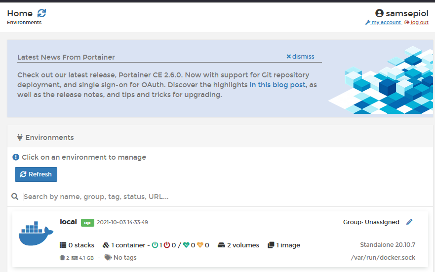
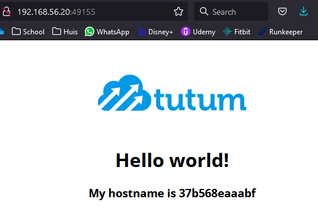
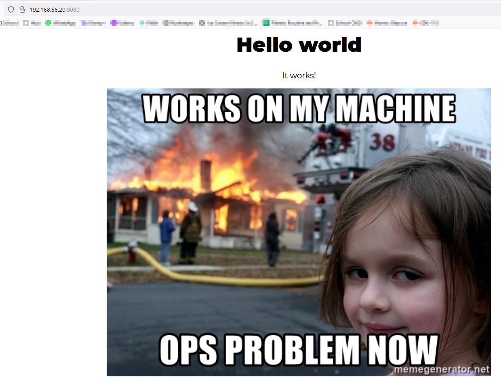
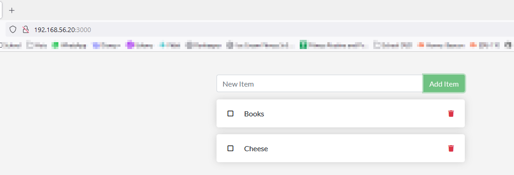
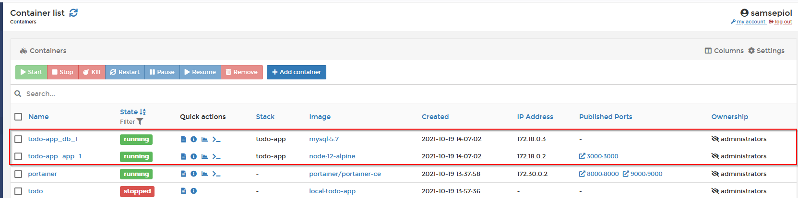
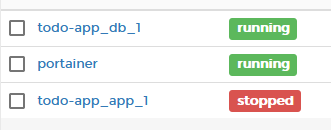
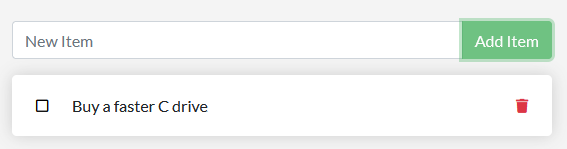

# Lab Report: Containers

## Steps

#### 1.1. Bring up vagrant environment
```
Yves@Q MINGW64 ~/Automation/infra-2122-Yves-Masscho/dockerlab (solution)
$ vagrant up
Bringing machine 'dockerlab' up with 'virtualbox' provider...
```

```
PLAY RECAP *********************************************************************
dockerlab                  : ok=13   changed=9    unreachable=0    failed=0    skipped=0    rescued=0    ignored=0
```

###### System checks to see if docker and portainer work out of the box.system
* Docker is running, checked with `systemctl status docker`.
```
vagrant@dockerlab:~$ systemctl status docker
● docker.service - Docker Application Container Engine
     Loaded: loaded (/lib/systemd/system/docker.service; enabled; vendor preset: enabled)
     Active: active (running) since Sat 2021-10-02 12:03:07 UTC; 24h ago
TriggeredBy: ● docker.socket
       Docs: https://docs.docker.com
   Main PID: 24129 (dockerd)
      Tasks: 27
     Memory: 68.2M
     CGroup: /system.slice/docker.service
             ├─24129 /usr/bin/dockerd -H fd:// --containerd=/run/containerd/containerd.sock
             ├─36088 /usr/bin/docker-proxy -proto tcp -host-ip 0.0.0.0 -host-port 9000 -container-ip 172.30.0.2 -container-port 9000
             └─36107 /usr/bin/docker-proxy -proto tcp -host-ip 0.0.0.0 -host-port 8000 -container-ip 172.30.0.2 -container-port 8000
```
* Portainer is running
```
vagrant@dockerlab:~$ docker ps
CONTAINER ID   IMAGE                    COMMAND        CREATED        STATUS        PORTS                                                      NAMES
86c8d55e85b8   portainer/portainer-ce   "/portainer"   25 hours ago   Up 20 hours   0.0.0.0:8000->8000/tcp, 0.0.0.0:9000->9000/tcp, 9443/tcp   portainer
```
* Portainer is reachable through the url (a: samsepiol p: fsociety)



#### 1.2 First containers

###### 1.2.1. Hello world
* The hello world app works fine.

```
vagrant@dockerlab:~$ docker run hello-world
Unable to find image 'hello-world:latest' locally
latest: Pulling from library/hello-world
2db29710123e: Pull complete
Digest: sha256:9ade9cc2e26189a19c2e8854b9c8f1e14829b51c55a630ee675a5a9540ef6ccf
Status: Downloaded newer image for hello-world:latest

Hello from Docker!
...
```
* `docker ps` shows all running containers
```
vagrant@dockerlab:~$ docker ps
CONTAINER ID   IMAGE                    COMMAND        CREATED        STATUS        PORTS                                                      NAMES
86c8d55e85b8   portainer/portainer-ce   "/portainer"   25 hours ago   Up 20 hours   0.0.0.0:8000->8000/tcp, 0.0.0.0:9000->9000/tcp, 9443/tcp   portainer
```
* the `-a` option shows all stopped containers on top of the running ones.
```
vagrant@dockerlab:~$ docker ps -a
CONTAINER ID   IMAGE                    COMMAND        CREATED         STATUS                     PORTS                                                      NAMES
667a7850fc81   hello-world              "/hello"       3 minutes ago   Exited (0) 3 minutes ago                                                              keen_meninsky
86c8d55e85b8   portainer/portainer-ce   "/portainer"   25 hours ago    Up 20 hours                0.0.0.0:8000->8000/tcp, 0.0.0.0:9000->9000/tcp, 9443/tcp   portainer
```
* We remove the hello world app and its image.
```
vagrant@dockerlab:~$ docker rmi hello-world
Error response from daemon: conflict: unable to remove repository reference "hello-world" (must force) - container 667a7850fc81 is using its referenced image feb5d9fea6a5

vagrant@dockerlab:~$ docker rm 667a7850fc81
667a7850fc81

vagrant@dockerlab:~$ docker rmi hello-world
Untagged: hello-world:latest
Untagged: hello-world@sha256:9ade9cc2e26189a19c2e8854b9c8f1e14829b51c55a630ee675a5a9540ef6ccf
Deleted: sha256:feb5d9fea6a5e9606aa995e879d862b825965ba48de054caab5ef356dc6b3412
Deleted: sha256:e07ee1baac5fae6a26f30cabfe54a36d3402f96afda318fe0a96cec4ca393359
```

###### 1.2.2. Alpine Linux

* We run `docker run -i -t --name alpine alpine` and check some info on the host (not the shell).
```
vagrant@dockerlab:~$ docker container ls
CONTAINER ID   IMAGE                    COMMAND        CREATED              STATUS              PORTS                                                      NAMES
2dd6a955b5d9   alpine                   "/bin/sh"      About a minute ago   Up About a minute                                                              alpine
86c8d55e85b8   portainer/portainer-ce   "/portainer"   25 hours ago         Up 21 hours         0.0.0.0:8000->8000/tcp, 0.0.0.0:9000->9000/tcp, 9443/tcp   portainer

vagrant@dockerlab:~$ docker inspect alpine
[
    {
        "Id": "2dd6a955b5d94d1b26fdffbb069b3864125ab5ae102a7850a29fe855a6aa353e",
        "Created": "2021-10-03T13:28:33.833771833Z",
        "Path": "/bin/sh",
        "Args": [],
...
]

vagrant@dockerlab:~$ docker top alpine
UID                 PID                 PPID                C                   STIME               TTY                 TIME                CMD
root                44075               44055               0                   13:28               pts/0               00:00:00            /bin/sh
```
* We open a shell inside the shell.
```
vagrant@dockerlab:~$ docker run -i -t --name alpine alpine
Unable to find image 'alpine:latest' locally
latest: Pulling from library/alpine
a0d0a0d46f8b: Pull complete
Digest: sha256:e1c082e3d3c45cccac829840a25941e679c25d438cc8412c2fa221cf1a824e6a
Status: Downloaded newer image for alpine:latest

/ # ls
bin    dev    etc    home   lib    media  mnt    opt    proc   root   run    sbin   srv    sys    tmp    usr    var

/ # ip a
1: lo: <LOOPBACK,UP,LOWER_UP> mtu 65536 qdisc noqueue state UNKNOWN qlen 1000
    link/loopback 00:00:00:00:00:00 brd 00:00:00:00:00:00
    inet 127.0.0.1/8 scope host lo
       valid_lft forever preferred_lft forever
138: eth0@if139: <BROADCAST,MULTICAST,UP,LOWER_UP,M-DOWN> mtu 1500 qdisc noqueue state UP
    link/ether 02:42:ac:11:00:02 brd ff:ff:ff:ff:ff:ff
    inet 172.17.0.2/16 brd 172.17.255.255 scope global eth0
       valid_lft forever preferred_lft forever

/ # exit
```
* ls and ps don't show anything anymore when exiting the shell. Inspect shows the same output as above. Container is not running.

```
vagrant@dockerlab:~$ docker container ls
CONTAINER ID   IMAGE                    COMMAND        CREATED        STATUS        PORTS                                                      NAMES
86c8d55e85b8   portainer/portainer-ce   "/portainer"   25 hours ago   Up 21 hours   0.0.0.0:8000->8000/tcp, 0.0.0.0:9000->9000/tcp, 9443/tcp   portainer

vagrant@dockerlab:~$ docker top alpine
Error response from daemon: Container 2dd6a955b5d94d1b26fdffbb069b3864125ab5ae102a7850a29fe855a6aa353e is not running
```
* `docker run -i -t -d --name alpine alpine` and docker indeed complains that a container with that name already exists.
```
vagrant@dockerlab:~$ docker run -i -t -d --name alpine alpine
docker: Error response from daemon: Conflict. The container name "/alpine" is already in use by container "2dd6a955b5d94d1b26fdffbb069b3864125ab5ae102a7850a29fe855a6aa353e". You have to remove (or rename) that container to be able to reuse that name.
See 'docker run --help'.
```
* Remove and re-run
```
vagrant@dockerlab:~$ docker rm alpine
alpine

vagrant@dockerlab:~$ docker run -i -t -d --name alpine alpine
b5094034113805a37236a41c2419653084eae75fc26b4e69e9b1eb6a72872827

vagrant@dockerlab:~$ docker exec -t alpine /bin/hostname
b50940341138

vagrant@dockerlab:~$ docker exec -t alpine /sbin/ip a
1: lo: <LOOPBACK,UP,LOWER_UP> mtu 65536 qdisc noqueue state UNKNOWN qlen 1000
    link/loopback 00:00:00:00:00:00 brd 00:00:00:00:00:00
    inet 127.0.0.1/8 scope host lo
       valid_lft forever preferred_lft forever
140: eth0@if141: <BROADCAST,MULTICAST,UP,LOWER_UP,M-DOWN> mtu 1500 qdisc noqueue state UP
    link/ether 02:42:ac:11:00:02 brd ff:ff:ff:ff:ff:ff
    inet 172.17.0.2/16 brd 172.17.255.255 scope global eth0
       valid_lft forever preferred_lft forever

vagrant@dockerlab:~$ docker exec -i -t alpine /bin/sh
/ # exit
```
* stop and remove
```
vagrant@dockerlab:~$ docker kill b50940341138
b50940341138

vagrant@dockerlab:~$ docker rm b50940341138
b50940341138

vagrant@dockerlab:~$ docker rmi alpine
Untagged: alpine:latest
Untagged: alpine@sha256:e1c082e3d3c45cccac829840a25941e679c25d438cc8412c2fa221cf1a824e6a
Deleted: sha256:14119a10abf4669e8cdbdff324a9f9605d99697215a0d21c360fe8dfa8471bab
Deleted: sha256:e2eb06d8af8218cfec8210147357a68b7e13f7c485b991c288c2d01dc228bb68
```

###### 1.2.3. Running a web application

```
vagrant@dockerlab:~$ docker pull tutum/hello-world
Using default tag: latest
latest: Pulling from tutum/hello-world
Image docker.io/tutum/hello-world:latest uses outdated schema1 manifest format. Please upgrade to a schema2 image for better future compatibility. More information at https://docs.docker.com/registry/spec/deprecated-schema-v1/
658bc4dc7069: Pull complete
a3ed95caeb02: Pull complete
af3cc4b92fa1: Pull complete
d0034177ece9: Pull complete
983d35417974: Pull complete
Digest: sha256:0d57def8055178aafb4c7669cbc25ec17f0acdab97cc587f30150802da8f8d85
Status: Downloaded newer image for tutum/hello-world:latest
docker.io/tutum/hello-world:latest

vagrant@dockerlab:~$ docker run -d -p 80 --name helloapp tutum/hello-world
37b568eaaabf8b42f3667cd9c3d9a54a511642a1a892799a7f7fcb6c85141c0b
```
* We check with `docker ps` which port is used: 49155
```
vagrant@dockerlab:~$ docker ps | grep "hello"
37b568eaaabf   tutum/hello-world        "/bin/sh -c 'php-fpm…"   4 minutes ago   Up 4 minutes   0.0.0.0:49155->80/tcp, :::49155->80/tcp                    helloapp
```
* We check `curl`
```
vagrant@dockerlab:~$ curl http://192.168.56.20:49155
<html>
<head>
        <title>Hello world!</title>
        <link href='http://fonts.googleapis.com/css?family=Open+Sans:400,700' rel='stylesheet' type='text/css'>
        <style>
        body {
                background-color: white;
                text-align: center;
                padding: 50px;
                font-family: "Open Sans","Helvetica Neue",Helvetica,Arial,sans-serif;
        }

        #logo {
                margin-bottom: 40px;
        }
        </style>
</head>
<body>
        
        <h1>Hello world!</h1>
        <h3>My hostname is 37b568eaaabf</h3>    </body>
</html>
```
* And we surf to the website through the host system, the ID is the same as with `docker ps | grep "hello"`



#### 1.3. Persistent data

###### MySQL

* We create the volume first
```
vagrant@dockerlab:~$ docker volume create mysql-data
mysql-data

vagrant@dockerlab:~$ docker volume inspect mysql-data
[
    {
        "CreatedAt": "2021-10-04T16:26:46Z",
        "Driver": "local",
        "Labels": {},
        "Mountpoint": "/var/lib/docker/volumes/mysql-data/_data",
        "Name": "mysql-data",
        "Options": {},
        "Scope": "local"
    }
]

vagrant@dockerlab:~$ docker volume ls
DRIVER    VOLUME NAME
local     be28cb21bb9447a28d74a374715198ecd5d6a3f7f0af781a56a32e0d00b47d21
local     mysql-data
local     portainer_data
local     test
```
* We make a container with below parameters, coupled to the previously made volume.
```
vagrant@dockerlab:~$ docker run --name db -d \
>   -v mysql-data:/var/lib/mysql \
>   -p 3306:3306 \
>   -e MYSQL_DATABASE='appdb' \
>   -e MYSQL_USER='appusr' \
>   -e MYSQL_PASSWORD='letmein' \
>   -e MYSQL_ROOT_PASSWORD='letmein' \
>   mysql:5.7
Unable to find image 'mysql:5.7' locally
5.7: Pulling from library/mysql
07aded7c29c6: Pull complete
f68b8cbd22de: Pull complete
30c1754a28c4: Pull complete
1b7cb4d6fe05: Pull complete
79a41dc56b9a: Pull complete
00a75e3842fb: Pull complete
b36a6919c217: Pull complete
5e11fe494f45: Pull complete
9c7de1f889a7: Pull complete
cf6a13d05a76: Pull complete
fc5aa81f393a: Pull complete
Digest: sha256:360c7488c2b5d112804a74cd272d1070d264eef4812d9a9cc6b8ed68c3546189
Status: Downloaded newer image for mysql:5.7
4b3705d261545c211c61776951bdd8d0163cd54505e4eda1172d3ebcfbc71b69
```
* We make a table and add some info and then query it.
```
mysql> select * from Catalog;
+-----------+-----------------+-------------------+------------------------+--------------------------+----------------+
| CatalogId | Journal         | Publisher         | Edition                | Title                    | Author         |
+-----------+-----------------+-------------------+------------------------+--------------------------+----------------+
|         1 | Oracle Magazine | Oracle Publishing | November December 2013 | Engineering as a Service | David A. Kelly |
|         2 | Iron Man        | Marvel            | 1963                   | The invincible Iron Man  | Larry Lieber   |
+-----------+-----------------+-------------------+------------------------+--------------------------+----------------+
2 rows in set (0.00 sec)
```
* I don't have MYSQL workbench but a query from the main VM works.
```
vagrant@dockerlab:~$ mysql -h 192.168.56.20 -P 3306 -uappusr -pletmein appdb <<< "SELECT * FROM Catalog;"
mysql: [Warning] Using a password on the command line interface can be insecure.
CatalogId       Journal Publisher       Edition Title   Author
1       Oracle Magazine Oracle Publishing       November December 2013  Engineering as a Service        David A. Kelly
2       Iron Man        Marvel  1963    The invincible Iron Man Larry Lieber
```
* Stopping the container and starting it again does not delete the data.

```
vagrant@dockerlab:~$ docker stop db
db

vagrant@dockerlab:~$ docker start db
db

vagrant@dockerlab:~$ mysql -h 192.168.56.20 -P 3306 -uappusr -pletmein appdb <<< "SELECT * FROM Catalog;"
mysql: [Warning] Using a password on the command line interface can be insecure.
CatalogId       Journal Publisher       Edition Title   Author
1       Oracle Magazine Oracle Publishing       November December 2013  Engineering as a Service        David A. Kelly
2       Iron Man        Marvel  1963    The invincible Iron Man Larry Lieber
```

#### 1.4. Custom Images

* We install a container with a dockerfile found in the static-website folder.

```
vagrant@dockerlab:/vagrant/labs/static-website$ docker image build --tag local:static-site .
Sending build context to Docker daemon  417.8kB
Step 1/9 : FROM alpine:latest
latest: Pulling from library/alpine
a0d0a0d46f8b: Pull complete
Digest: sha256:e1c082e3d3c45cccac829840a25941e679c25d438cc8412c2fa221cf1a824e6a
Status: Downloaded newer image for alpine:latest
 ---> 14119a10abf4
Step 2/9 : LABEL description="This example Dockerfile installs NGINX."
 ---> Running in da9a2b6aa19c
Removing intermediate container da9a2b6aa19c
 ---> 152562aa1541
Step 3/9 : RUN apk add --update nginx &&     rm -rf /var/cache/apk/* &&     mkdir -p /tmp/nginx/
 ---> Running in de2de76fe6c1
fetch https://dl-cdn.alpinelinux.org/alpine/v3.14/main/x86_64/APKINDEX.tar.gz
fetch https://dl-cdn.alpinelinux.org/alpine/v3.14/community/x86_64/APKINDEX.tar.gz
(1/2) Installing pcre (8.44-r0)
(2/2) Installing nginx (1.20.1-r3)
Executing nginx-1.20.1-r3.pre-install
Executing nginx-1.20.1-r3.post-install
Executing busybox-1.33.1-r3.trigger
OK: 7 MiB in 16 packages
Removing intermediate container de2de76fe6c1
 ---> f84648f5c1e6
Step 4/9 : COPY files/nginx.conf /etc/nginx/nginx.conf
 ---> db4822a9a41e
Step 5/9 : COPY files/default.conf /etc/nginx/conf.d/default.conf
 ---> 715ed6f663e4
Step 6/9 : ADD files/site-contents.tar.bz2 /usr/share/nginx/
 ---> d1e976cc6618
Step 7/9 : EXPOSE 80/tcp
 ---> Running in 0f72d86cdb7e
Removing intermediate container 0f72d86cdb7e
 ---> b680ef66274f
Step 8/9 : ENTRYPOINT ["nginx"]
 ---> Running in 764192507d33
Removing intermediate container 764192507d33
 ---> b53a179135c8
Step 9/9 : CMD ["-g", "daemon off;"]
 ---> Running in ca884501bd20
Removing intermediate container ca884501bd20
 ---> 8b9db12bc216
Successfully built 8b9db12bc216
Successfully tagged local:static-site

vagrant@dockerlab:/vagrant/labs/static-website$ docker image ls
REPOSITORY               TAG           IMAGE ID       CREATED                  SIZE
local                    static-site   8b9db12bc216   Less than a second ago   7.24MB
portainer/portainer-ce   latest        bc46de77a3ff   6 days ago               252MB
alpine                   latest        14119a10abf4   7 weeks ago              5.6MB
```

* We run the container with forward port 8080 en check if it is live with `curl`. 

```
vagrant@dockerlab:/vagrant/labs/static-website$ docker run -d -p 8080:80 --name nginx local:static-site
57adb10568b096045e21d7ed09c27606a2d1a319b2253a0d8b8aa9afafcf2152

vagrant@dockerlab:/vagrant/labs/static-website$ curl http://localhost:8080/
<html>
    <head>
        <title>Success!</title>
        <link href="https://fonts.googleapis.com/css2?family=Montserrat:wght@400;900&display=swap" rel="stylesheet">
        <style>
        table, th, td {
          border-bottom: 1px solid black;
          padding: 10px;
          border-collapse: collapse;
          text-align: center;
        }
        .center {
          margin-left: auto;
          margin-right: auto;
        }
        h1 {
          text-align: center;
          font-size: 50px;
        }
        p {
          text-align: center;
        }
        .center {
          display: block;
          margin-left: auto;
          margin-right: auto;
          width: 50%;
        }
        * {
          font-family: Montserrat;
          font-size: 20px;
        }
        </style>
    </head>
    <body>
        <h1>Hello world</h1>
        <p>It works!</p>

        
    </body>
</html>vagrant@dockerlab:/vagrant/labs/static-website$
```
* This also works through the browser.



#### 1.5 Layered file system

* run inspect
```
vagrant@dockerlab:/vagrant/labs/static-website$ docker image inspect alpine:latest | jq ".[]|.RootFS.Layers"
[
  "sha256:e2eb06d8af8218cfec8210147357a68b7e13f7c485b991c288c2d01dc228bb68"
]

vagrant@dockerlab:/vagrant/labs/static-website$ docker image inspect local:static-site | jq ".[]|.RootFS.Layers"
[
  "sha256:e2eb06d8af8218cfec8210147357a68b7e13f7c485b991c288c2d01dc228bb68",
  "sha256:034d665710c01d2899c73197dda06d39d5fb40473d47de9ea6cc8cff8d9f725d",
  "sha256:c6564e3a2db66f05ead902c7576a66101493b511cfee008c5726fd1cc68028a6",
  "sha256:16f0df551751f9c75b101cf5f4b5d7c57075817b8e812707608441414b0e8093",
  "sha256:475e87805b56f4afcd4ee7342f701214eab95fd22bf5b3c1714abc5930b30ebc"
]

```
* Do everything in 1.4 again with RUN directive split up
```
vagrant@dockerlab:/vagrant/labs/static-website-2$ docker image build --tag local:static-site .
Sending build context to Docker daemon  417.8kB
Step 1/11 : FROM alpine:latest
latest: Pulling from library/alpine
a0d0a0d46f8b: Pull complete
Digest: sha256:e1c082e3d3c45cccac829840a25941e679c25d438cc8412c2fa221cf1a824e6a
Status: Downloaded newer image for alpine:latest
 ---> 14119a10abf4
Step 2/11 : LABEL description="This example Dockerfile installs NGINX."
 ---> Running in 8d2bf53f27d5
Removing intermediate container 8d2bf53f27d5
 ---> b4ca41a5b067
Step 3/11 : RUN apk add --update nginx
 ---> Running in 943030d0f048
fetch https://dl-cdn.alpinelinux.org/alpine/v3.14/main/x86_64/APKINDEX.tar.gz
fetch https://dl-cdn.alpinelinux.org/alpine/v3.14/community/x86_64/APKINDEX.tar.gz
(1/2) Installing pcre (8.44-r0)
(2/2) Installing nginx (1.20.1-r3)
Executing nginx-1.20.1-r3.pre-install
Executing nginx-1.20.1-r3.post-install
Executing busybox-1.33.1-r3.trigger
OK: 7 MiB in 16 packages
Removing intermediate container 943030d0f048
 ---> e01914a2f95e
Step 4/11 : RUN rm -rf /var/cache/apk/*
 ---> Running in 920acabbc719
Removing intermediate container 920acabbc719
 ---> de326661034f
Step 5/11 : RUN mkdir -p /tmp/nginx/
 ---> Running in e31b1f0eee58
Removing intermediate container e31b1f0eee58
 ---> c02207a30ac7
Step 6/11 : COPY files/nginx.conf /etc/nginx/nginx.conf
 ---> 26732ac41bce
Step 7/11 : COPY files/default.conf /etc/nginx/conf.d/default.conf
 ---> c737d5ae922d
Step 8/11 : ADD files/site-contents.tar.bz2 /usr/share/nginx/
 ---> a728a4147871
Step 9/11 : EXPOSE 80/tcp
 ---> Running in 499951bf72fb
Removing intermediate container 499951bf72fb
 ---> ec6c68a06802
Step 10/11 : ENTRYPOINT ["nginx"]
 ---> Running in cbee4f508187
Removing intermediate container cbee4f508187
 ---> 0af38085e9e0
Step 11/11 : CMD ["-g", "daemon off;"]
 ---> Running in 2a61ca885495
Removing intermediate container 2a61ca885495
 ---> 5a055d1be2a9
Successfully built 5a055d1be2a9
Successfully tagged local:static-site

vagrant@dockerlab:/vagrant/labs/static-website-2$ docker run -d -p 8080:80 --name nginx2 local:static-site
0d27c5fcef614dfc613db47a308e166d0a9b6df55cf188de4b4e6d4fd041e6f1

vagrant@dockerlab:/vagrant/labs/static-website-2$ docker image inspect alpine:latest | jq ".[]|.RootFS.Layers"
[
  "sha256:e2eb06d8af8218cfec8210147357a68b7e13f7c485b991c288c2d01dc228bb68"
]

vagrant@dockerlab:/vagrant/labs/static-website-2$ docker image inspect local:static-site-2 | jq ".[]|.RootFS.Layers"
[
  "sha256:e2eb06d8af8218cfec8210147357a68b7e13f7c485b991c288c2d01dc228bb68",
  "sha256:ec290221620964acdd1568ce16f747f38c8b432899f68a1cdc6c9512e5fc7c61",
  "sha256:9c96db97b59bc5e67c9a27da5c831eba1acc2c1242a427947634805ab103fbf8",
  "sha256:f27856bd20c007d6f135ea690b93a32b922b06e52bbb947213cb0568186901e4",
  "sha256:7a2540b19a9be35487e24efae007e2e2a50b8ad813b121b91e836d5464428ffe",
  "sha256:6b98cf96242aa7858b0acb60d60c4a449a5b80267737decccf46083ef61665a5",
  "sha256:e301a23cd0001c0686a2e8e776adf42aff4e7d9b0e12885b84d9e61deca3a9ef"
]
```
* The output of inspect shows us 7 layers, twee more than before. Two steps were also added to the output above.


#### 1.6 Docker Compose

* We now build the todo-app also found in the app folder.

```
vagrant@dockerlab:~$ cd /vagrant/labs/todo-app/

vagrant@dockerlab:/vagrant/labs/todo-app$ docker image build --tag local:todo-app .
Sending build context to Docker daemon  4.662MB
Step 1/6 : FROM node:12-alpine
12-alpine: Pulling from library/node
6a428f9f83b0: Pull complete
f2b1fb32259e: Pull complete
40888f2a0a1f: Pull complete
c00591d296bd: Pull complete
Digest: sha256:dfbebf17bfb014e1e7068e76325a117bccf8679c68aec6a28514184a209c8bae
Status: Downloaded newer image for node:12-alpine
 ---> c8657370ddfc
Step 2/6 : RUN apk add --no-cache python g++ make
 ---> Running in a90335c0ad85
fetch http://dl-cdn.alpinelinux.org/alpine/v3.11/main/x86_64/APKINDEX.tar.gz
fetch http://dl-cdn.alpinelinux.org/alpine/v3.11/community/x86_64/APKINDEX.tar.gz
(1/21) Installing binutils (2.33.1-r1)
(2/21) Installing gmp (6.1.2-r1)
(3/21) Installing isl (0.18-r0)
(4/21) Installing libgomp (9.3.0-r0)
(5/21) Installing libatomic (9.3.0-r0)
(6/21) Installing mpfr4 (4.0.2-r1)
(7/21) Installing mpc1 (1.1.0-r1)
(8/21) Installing gcc (9.3.0-r0)
(9/21) Installing musl-dev (1.1.24-r3)
(10/21) Installing libc-dev (0.7.2-r0)
(11/21) Installing g++ (9.3.0-r0)
(12/21) Installing make (4.2.1-r2)
(13/21) Installing libbz2 (1.0.8-r1)
(14/21) Installing expat (2.2.9-r1)
(15/21) Installing libffi (3.2.1-r6)
(16/21) Installing gdbm (1.13-r1)
(17/21) Installing ncurses-terminfo-base (6.1_p20200118-r4)
(18/21) Installing ncurses-libs (6.1_p20200118-r4)
(19/21) Installing readline (8.0.1-r0)
(20/21) Installing sqlite-libs (3.30.1-r2)
(21/21) Installing python2 (2.7.18-r0)
Executing busybox-1.31.1-r10.trigger
OK: 212 MiB in 37 packages
Removing intermediate container a90335c0ad85
 ---> 98bb790eed0c
Step 3/6 : WORKDIR /app
 ---> Running in 28f7e9b0294d
Removing intermediate container 28f7e9b0294d
 ---> cf4188b76134
Step 4/6 : COPY . .
 ---> c75d0b108e42
Step 5/6 : RUN yarn install --production
 ---> Running in b82c400855d2
yarn install v1.22.15
[1/4] Resolving packages...
[2/4] Fetching packages...
info fsevents@1.2.9: The platform "linux" is incompatible with this module.
info "fsevents@1.2.9" is an optional dependency and failed compatibility check. Excluding it from installation.
[3/4] Linking dependencies...
[4/4] Building fresh packages...
Done in 11.28s.
Removing intermediate container b82c400855d2
 ---> 48e127daaec6
Step 6/6 : CMD ["node", "src/index.js"]
 ---> Running in 6d0753bd587e
Removing intermediate container 6d0753bd587e
 ---> 39de08810071
Successfully built 39de08810071
Successfully tagged local:todo-app

vagrant@dockerlab:/vagrant/labs/todo-app$ docker run -d -p 3000:3000 --name todo local:todo-app
3bf815deb3c4985a63c9e24c376b23eef6e6621e1ad6bf2523c2800d0e0b0c91

```
* This works



* Stop running container and use docker-compose. I run into a http timeout, somehow my computer has been very slow doing some things like vagrant up, etc. But I run the command again and everything seems up.

```
vagrant@dockerlab:/vagrant/labs/todo-app$ docker stop todo
todo
vagrant@dockerlab:/vagrant/labs/todo-app$ docker-compose up -d
Creating network "todo-app_default" with the default driver
Creating volume "todo-app_todo-mysql-data" with default driver
Pulling db (mysql:5.7)...
5.7: Pulling from library/mysql
b380bbd43752: Pull complete
f23cbf2ecc5d: Pull complete
30cfc6c29c0a: Pull complete
b38609286cbe: Pull complete
8211d9e66cd6: Pull complete
2313f9eeca4a: Pull complete
7eb487d00da0: Pull complete
a71aacf913e7: Pull complete
393153c555df: Pull complete
06628e2290d7: Pull complete
ff2ab8dac9ac: Pull complete
Digest: sha256:2db8bfd2656b51ded5d938abcded8d32ec6181a9eae8dfc7ddf87a656ef97e97
Status: Downloaded newer image for mysql:5.7
Creating todo-app_db_1 ...
Creating todo-app_app_1 ...

ERROR: for todo-app_app_1  UnixHTTPConnectionPool(host='localhost', port=None): Read timed out. (read timeout=60)

ERROR: for todo-app_db_1  UnixHTTPConnectionPool(host='localhost', port=None): Read timed out. (read timeout=60)

ERROR: for app  UnixHTTPConnectionPool(host='localhost', port=None): Read timed out. (read timeout=60)

ERROR: for db  UnixHTTPConnectionPool(host='localhost', port=None): Read timed out. (read timeout=60)
ERROR: An HTTP request took too long to complete. Retry with --verbose to obtain debug information.
If you encounter this issue regularly because of slow network conditions, consider setting COMPOSE_HTTP_TIMEOUT to a higher value (current value: 60).

vagrant@dockerlab:/vagrant/labs/todo-app$ docker-compose up -d
Starting todo-app_db_1  ... done
Starting todo-app_app_1 ... done
```
* This gives us the following



* But the app container keeps stopping



* By following the instructions on the Errata channel on Teams we solved this problem.




* We look at an overview of the containers and go into the 'app' console. Ping does not work, but we do find the ip/name resolution of the two apps with getent ahosts name.

```
vagrant@dockerlab:~/todo-app$ docker ps
CONTAINER ID   IMAGE                    COMMAND                  CREATED          STATUS          PORTS                                                      NAMES
8be51f712dab   node:12-alpine           "docker-entrypoint.s…"   6 minutes ago    Up 5 minutes    0.0.0.0:3000->3000/tcp, :::3000->3000/tcp                  todo-app_app_1
41d2d2894d99   mysql:5.7                "docker-entrypoint.s…"   6 minutes ago    Up 5 minutes    3306/tcp, 33060/tcp                                        todo-app_db_1
ff25c14e82de   portainer/portainer-ce   "/portainer"             44 minutes ago   Up 28 minutes   0.0.0.0:8000->8000/tcp, 0.0.0.0:9000->9000/tcp, 9443/tcp   portainer

vagrant@dockerlab:~/todo-app$ docker exec -it 41d2d2894d99 /bin/sh

# ping db
/bin/sh: 1: ping: not found

# getent ahosts db
172.18.0.3      STREAM db
172.18.0.3      DGRAM
172.18.0.3      RAW

# getent ahosts app
172.18.0.2      STREAM app
172.18.0.2      DGRAM
172.18.0.2      RAW

```
* After installing ping (`apt-get update` - `apt-get install iputils-ping`) in the container this works.
```
# ping db
PING db (172.18.0.3) 56(84) bytes of data.
64 bytes from 41d2d2894d99 (172.18.0.3): icmp_seq=1 ttl=64 time=0.017 ms
64 bytes from 41d2d2894d99 (172.18.0.3): icmp_seq=2 ttl=64 time=0.064 ms
64 bytes from 41d2d2894d99 (172.18.0.3): icmp_seq=3 ttl=64 time=0.054 ms
^C
--- db ping statistics ---
3 packets transmitted, 3 received, 0% packet loss, time 53ms
rtt min/avg/max/mdev = 0.017/0.045/0.064/0.020 ms
```

## Resources

* https://stackoverflow.com/questions/17157721/how-to-get-a-docker-containers-ip-address-from-the-host
* https://docs.docker.com/engine/reference/builder/
* https://stackoverflow.com/questions/20932357/how-to-enter-in-a-docker-container-already-running-with-a-new-tty
* https://stackoverflow.com/questions/39901311/docker-ubuntu-bash-ping-command-not-found