# Lab Report: Continuous Integration/Delivery with Jenkins

## Steps

## Running Jenkins

1. Because last lab had the whole setup of this same lab, and knowing how to work with github being a prerequisite to this course, made me decide to skip these steps in the report.

2. We ssh into our dockerlab VM and download the Jenkins image.

```
vagrant@dockerlab:~$ docker pull jenkins/jenkins:lts
lts: Pulling from jenkins/jenkins
bb7d5a84853b: Pull complete
3e2bcf6b1921: Pull complete
978539702e19: Pull complete
7fa18bcbf207: Pull complete
a67725ef6531: Pull complete
be5329269e0a: Pull complete
f1514eafcdb2: Pull complete
a1f0f8fcd02d: Pull complete
8d76f0dde4b9: Pull complete
9f47eedf727b: Pull complete
74d1ec398ccc: Pull complete
df71683f45f5: Pull complete
95c82c721e5c: Pull complete
2569d89b2015: Pull complete
40a8b1ea9f1c: Pull complete
4d4e70b7b6df: Pull complete
d112a9446c9f: Pull complete
Digest: sha256:510c7e5a5e62049e48f5d01cc6a5e03197f84fbbce70ea51d9d788043926180a
Status: Downloaded newer image for jenkins/jenkins:lts
docker.io/jenkins/jenkins:lts

vagrant@dockerlab:~$ docker run -p 8080:8080 -u root \
>   -v jenkins-data:/var/jenkins_home \
>   -v $(which docker):/usr/bin/docker \
>   -v /var/run/docker.sock:/var/run/docker.sock \
>   -v "$HOME":/home \
>   --name jenkins_server jenkins/jenkins:lts
Running from: /usr/share/jenkins/jenkins.war
webroot: EnvVars.masterEnvVars.get("JENKINS_HOME")
2021-11-21 17:44:50.359+0000 [id=1]     INFO    org.eclipse.jetty.util.log.Log#initialized: Logging initialized @552ms to org.eclipse.jetty.util.log.JavaUtilLog
```

3. I ommited a lot of output above, but our password is `1c560bb7ad4c4c9dabe8deedd475c79d`

4. Surfing to the site with port 8080 and running the initial plugin install gives us the following. 

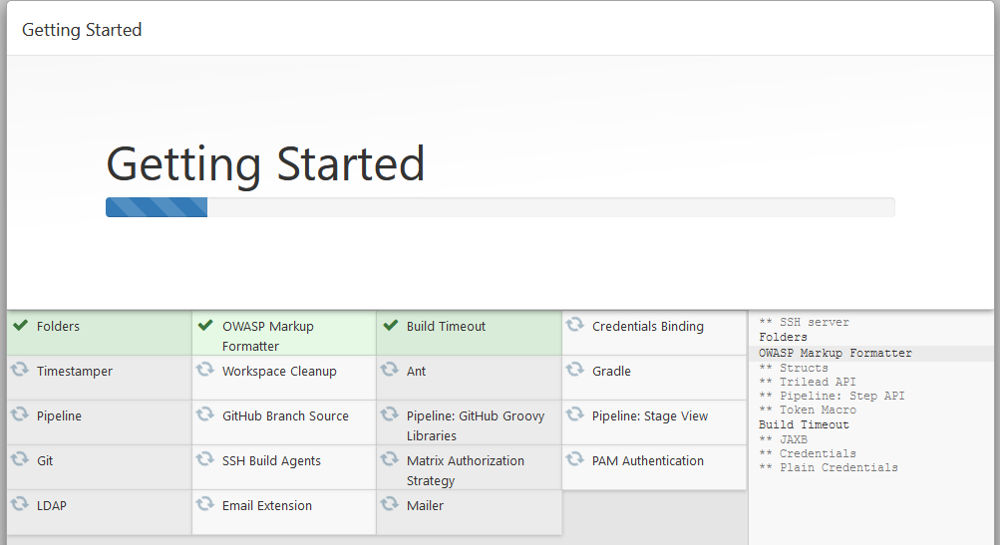

## Setting up the demo app

5. Inside the Jenkins GUI we choose Create a job.

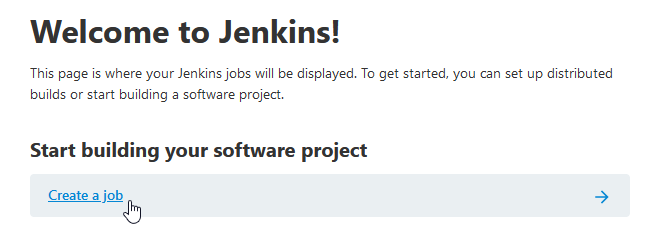

6. We name it BuildTheSampleApp and pick Freestyle Project.

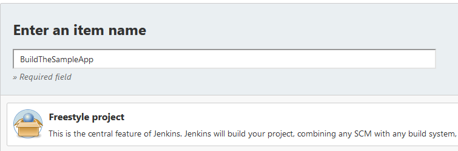

7. The GIT repo we made is inserted in the build steps.

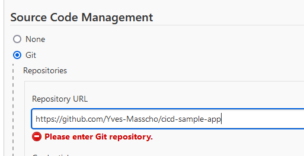

8. We change master to main.

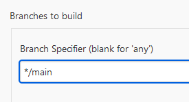

9. As a build step we pick execute shell with `sample-app.sh`as the script to run.

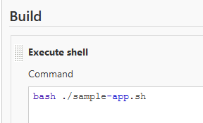

10. Final step is to actually build the app. We see our project in the dashboard and click it.

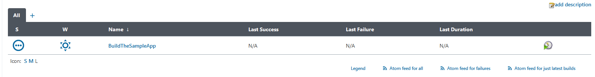

11. And click Build Now.

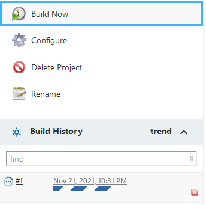

12. This works and gives us the following.

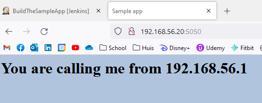

## Adding acceptance test

13. If a 'curl' is proposed from the VM, the address calling it will the the VM/host. We can use this fact to test a few things.

```
vagrant@dockerlab:~$ curl http://172.17.0.3:5050/
<html>
<head>
    <title>Sample app</title>
    <link rel="stylesheet" href="/static/style.css" />
</head>
<body>
    <h1>You are calling me from 172.17.0.1</h1>
</body>
``` 

14. For example we can run this test from the Jenkins server. For this we make another job.

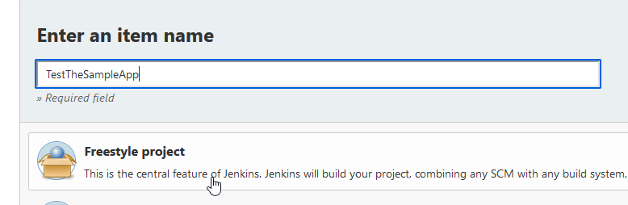

15. We set it up so that this job will only run after the BuildTheSampleApp job has finished/been built.

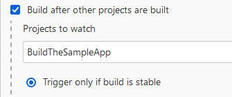

16. As a way of testing we execute the following shell command: `curl http://172.17.0.3:5050/ | grep "You are calling me from 172.17.0.2"` The first IP is the app, the second one the IP of our Jenkins container.

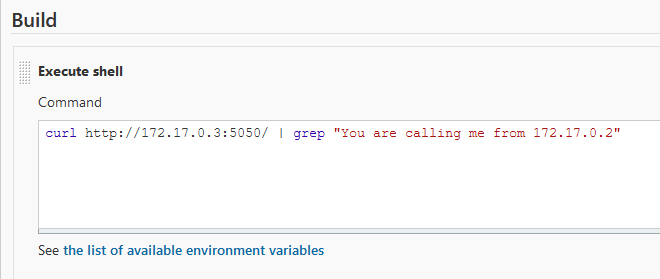

17. Running this job (and test) will be succesful, we can see this in the console output.

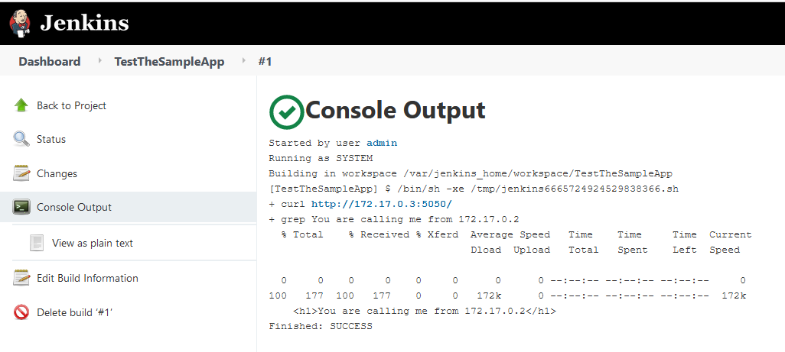

18. We destroy the sample app and run the test again, this will give us a negative result because the curl failed because the IP address isn't even used. It didn't even test the exact output.
```
vagrant@dockerlab:~$ docker rm -f samplerunning
samplerunning
```

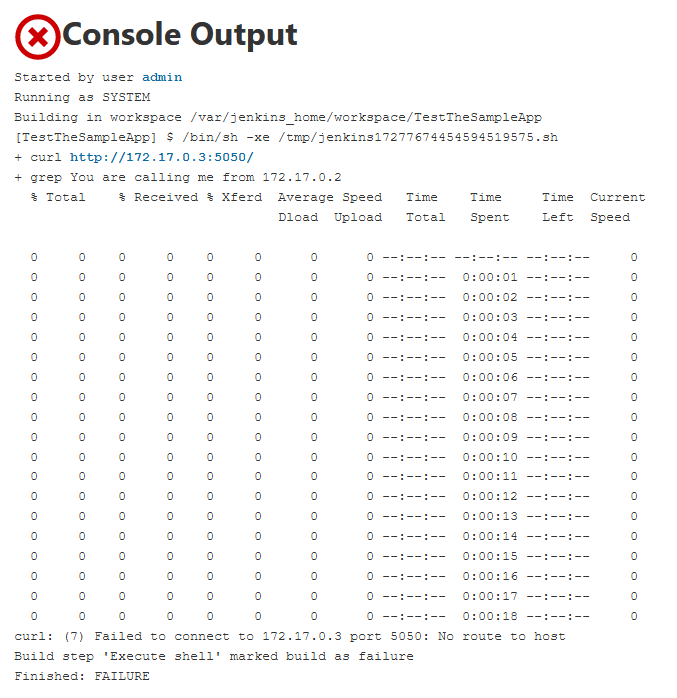

## Pipeline

19. We create a new job in Jenkins and this time we pick pipeline as the type.

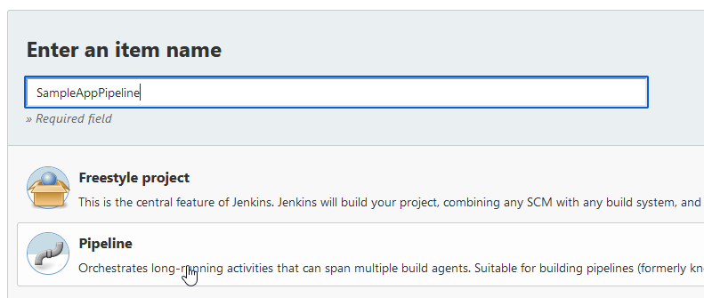

20. We enter the given script into the job.

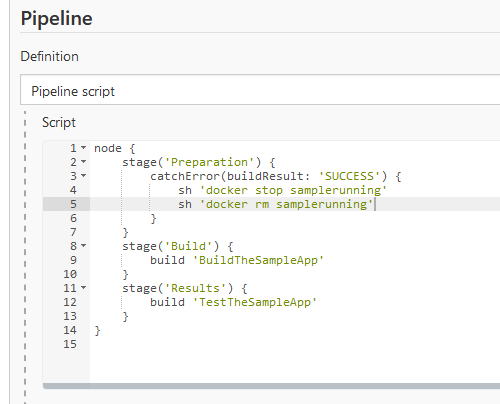

21. We try running it for a first time.

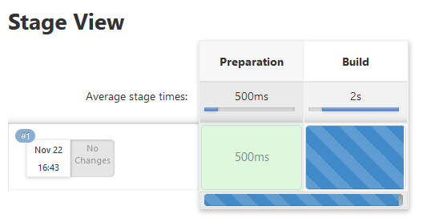

22. It fails.

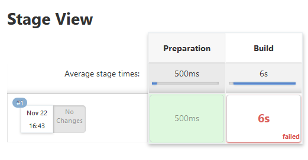

23. The console shows it failed because the connected `BuildTheSampleApp` failed.

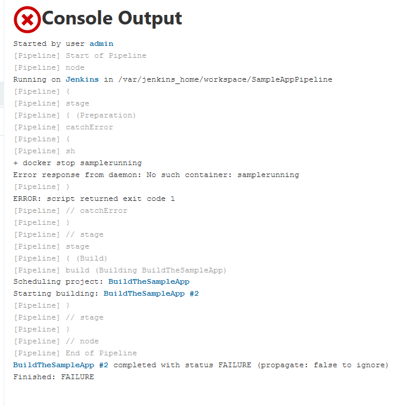

24. `BuildTheSampleApp` failed because the tempdir already exists.

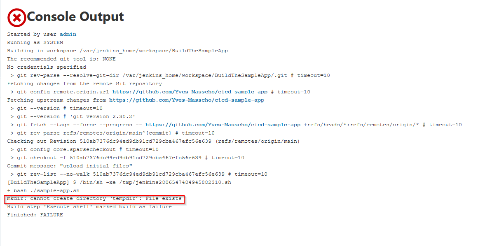

25. We remove the temp folder and run the BuildTheSampleApp job again.

```
vagrant@dockerlab:~$ docker exec -it jenkins_server rm -rfv /var/jenkins_home/workspace/BuildTheSampleApp/tempdir/
removed '/var/jenkins_home/workspace/BuildTheSampleApp/tempdir/Dockerfile'
removed '/var/jenkins_home/workspace/BuildTheSampleApp/tempdir/templates/index.html'
removed directory '/var/jenkins_home/workspace/BuildTheSampleApp/tempdir/templates'
removed '/var/jenkins_home/workspace/BuildTheSampleApp/tempdir/static/style.css'
removed directory '/var/jenkins_home/workspace/BuildTheSampleApp/tempdir/static'
removed '/var/jenkins_home/workspace/BuildTheSampleApp/tempdir/sample_app.py'
removed directory '/var/jenkins_home/workspace/BuildTheSampleApp/tempdir/'

```
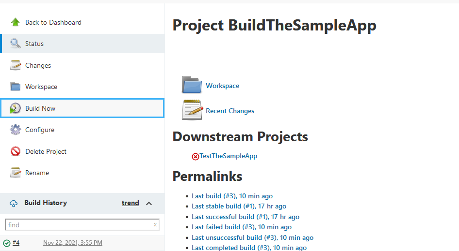

26. We enter the line of code into the script as wel.

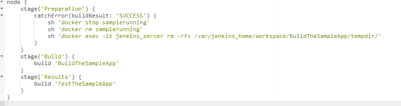

27. And run the job again. This time everything works perfectly.

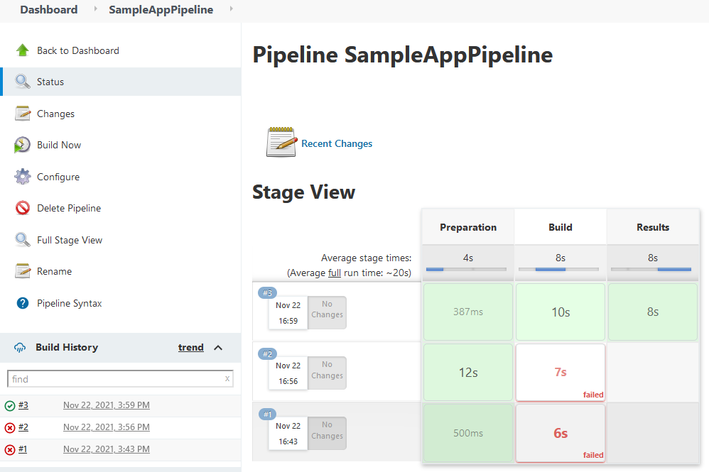

28. We check the browser and everything is up and running again.

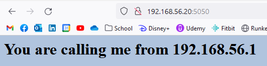

## Editing the pipeline

29. We edit the css in the github repo to DarkMagenta (will be so beautiful...not).

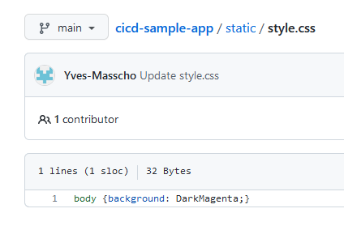

30. To make the standalone BuildTheSampleApp repeatable I added the removal of the temp folder into the script (without -it).

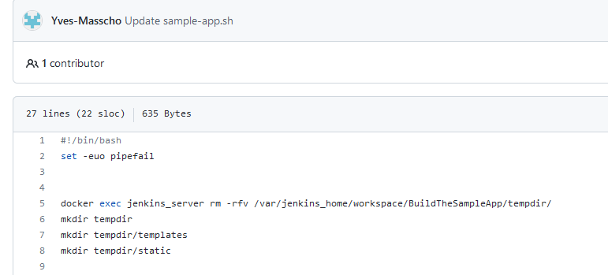

31. To make the pipeline script more robust I added the same line in the preparation bit of the script.

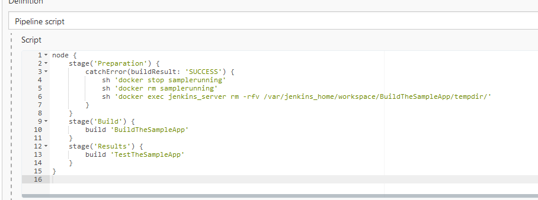

32. This gives us the amazing experience to the eyes of having the color changed to DarkMagenta.

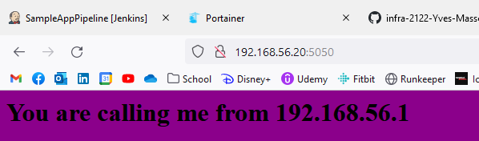

## Resources

- Overleg met mede-student Thomas Thomas over het probleem met de temp-folder (zijn command-line, waarschijnlijk wel anders geimplementeerd).