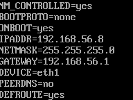

# Enterprise Linux Laboverslag - Troubleshooting

- Student: Yves Masscho
- Klasgroep: TIAOATN/S1 (Afstandsleren)

## Verslag

### Fase 1: Link Layer

- We kijken of kabels aangesloten zijn. Overal staat UP dus dit is in orde. Ook in VirtualBox lijkt alles op het eerste zicht OK.


### Fase 2: Network Layer

- We runnen `ip a` en zien dat de netmask van eth1 op /8 staat. We passen aan in ifcfg-eth1 naar 255.255.255.0 en voegen een DG toe en runnen nog eens.




- Even op gezocht maar we hebben twee keer dezelfde adapter. We verwijderen er 1. En we veranderen het type naar host-only.


- We hebben connectiviteit naar de DG en naar het internet


### Fase 3: Transport Layer

- We checken de ports. MariaDB runt niet op een standard port maar we zien later dat dit geen probleem geeft.
```
[root@fixme bin]# ss -tulpn
Netid     State       Recv-Q      Send-Q           Local Address:Port            Peer Address:Port     Process
udp       UNCONN      0           0                    127.0.0.1:323                  0.0.0.0:*         users:(("chronyd",pid=692,fd=6))
udp       UNCONN      0           0                      0.0.0.0:111                  0.0.0.0:*         users:(("rpcbind",pid=621,fd=5),("systemd",pid=1,fd=70))
udp       UNCONN      0           0                        [::1]:323                     [::]:*         users:(("chronyd",pid=692,fd=7))
udp       UNCONN      0           0                         [::]:111                     [::]:*         users:(("rpcbind",pid=621,fd=7),("systemd",pid=1,fd=72))
tcp       LISTEN      0           80                   127.0.0.1:12345                0.0.0.0:*         users:(("mariadbd",pid=6642,fd=17))
tcp       LISTEN      0           128                    0.0.0.0:111                  0.0.0.0:*         users:(("rpcbind",pid=621,fd=4),("systemd",pid=1,fd=69))
tcp       LISTEN      0           128                    0.0.0.0:22                   0.0.0.0:*         users:(("sshd",pid=761,fd=5))
tcp       LISTEN      0           128                          *:443                        *:*         users:(("httpd",pid=7957,fd=8),("httpd",pid=7956,fd=8),("httpd",pid=7955,fd=8),("httpd",pid=7952,fd=8))
tcp       LISTEN      0           128                       [::]:111                     [::]:*         users:(("rpcbind",pid=621,fd=6),("systemd",pid=1,fd=71))
tcp       LISTEN      0           128                          *:80                         *:*         users:(("httpd",pid=7957,fd=4),("httpd",pid=7956,fd=4),("httpd",pid=7955,fd=4),("httpd",pid=7952,fd=4))
tcp       LISTEN      0           128                       [::]:22                      [::]:*         users:(("sshd",pid=761,fd=7))
```

- We checken de status van Apache

```
[vagrant@fixme ~]$ systemctl status httpd
● httpd.service - The Apache HTTP Server
   Loaded: loaded (/usr/lib/systemd/system/httpd.service; disabled; vendor preset: disabled)
  Drop-In: /usr/lib/systemd/system/httpd.service.d
           └─php-fpm.conf
   Active: inactive (dead)
     Docs: man:httpd.service(8)
```


- Apache is niet enabled, dit doen we meteen met `systemctl enable --now httpd`

```
[root@fixme ~]# systemctl enable --now httpd
[root@fixme ~]# systemctl status httpd
● httpd.service - The Apache HTTP Server
   Loaded: loaded (/usr/lib/systemd/system/httpd.service; enabled; vendor preset: disabled)
  Drop-In: /usr/lib/systemd/system/httpd.service.d
           └─php-fpm.conf
   Active: active (running) since Sat 2021-11-27 13:36:27 UTC; 4s ago
     Docs: man:httpd.service(8)
 Main PID: 5882 (httpd)
   Status: "Started, listening on: port 443, port 80"
    Tasks: 213 (limit: 2748)
   Memory: 21.6M
   CGroup: /system.slice/httpd.service
           ├─5882 /usr/sbin/httpd -DFOREGROUND
           ├─5888 /usr/sbin/httpd -DFOREGROUND
           ├─5889 /usr/sbin/httpd -DFOREGROUND
           ├─5890 /usr/sbin/httpd -DFOREGROUND
           └─5892 /usr/sbin/httpd -DFOREGROUND
```
- MariaDB is wel running
```
[root@fixme bin]# systemctl status mariadb
● mariadb.service - MariaDB 10.6.5 database server
   Loaded: loaded (/usr/lib/systemd/system/mariadb.service; enabled; vendor preset: disabled)
  Drop-In: /etc/systemd/system/mariadb.service.d
           └─migrated-from-my.cnf-settings.conf
   Active: active (running) since Sat 2021-11-27 14:03:25 UTC; 34min ago
     Docs: man:mariadbd(8)
           https://mariadb.com/kb/en/library/systemd/
  Process: 6653 ExecStartPost=/bin/sh -c systemctl unset-environment _WSREP_START_POSITION (code=exite>
  Process: 6626 ExecStartPre=/bin/sh -c [ ! -e /usr/bin/galera_recovery ] && VAR= ||   VAR=`cd /usr/bi>
  Process: 6623 ExecStartPre=/bin/sh -c systemctl unset-environment _WSREP_START_POSITION (code=exited>
 Main PID: 6642 (mariadbd)
   Status: "Taking your SQL requests now..."
    Tasks: 8 (limit: 2748)
   Memory: 75.0M
   CGroup: /system.slice/mariadb.service
           └─6642 /usr/sbin/mariadbd
```

- We voegen http(80) en https(443) toe aan de firewall (permanent) en reloaden.
```
[root@fixme ~]# firewall-cmd --list-all
public (active)
  target: default
  icmp-block-inversion: no
  interfaces: eth0 eth1
  sources:
  services: cockpit dhcpv6-client ssh
  ports:
  protocols:
  masquerade: no
  forward-ports:
  source-ports:
  icmp-blocks:
  rich rules:
[root@fixme ~]# sudo firewall-cmd --add-service httpd --permanent
Error: INVALID_SERVICE: 'httpd' not among existing services
[root@fixme ~]# sudo firewall-cmd --add-service http --permanent
success
[root@fixme ~]# sudo firewall-cmd --add-service https --permanent
success
[root@fixme ~]# sudo firewall-cmd --reload
success
```

- poort 80 werkt:


- poort 443 werkt:


- Tests geven het volgende, logischerwijs lukt de laatste test nog niet.
```
[root@fixme bin]# ./acceptance.bats
 ✓ SELinux shoud be enforcing
 ✓ The firewall should be running
 ✓ I should have the correct IP address
 ✓ The Apache service should be running
 ✗ The correct website should be served
   (in test file acceptance.bats, line 30)
     `[ "${checksum}" = "86e61b7c9a1baad76185db291b0643f1  -" ]' failed

```

### Fase 4: APP Layer


- In onderstaande (origineel) veranderen we index.html naar index.php
- Het openen van permissies in httpd.conf naar `AllowOverride all Require all granted` veranderde niets.

```
[root@fixme conf]# cat httpd.conf
# Apache HTTP server - main configuration
#
# Ansible managed: httpd.conf.j2 modified on 2021-08-30 11:03:33 by bert on nb1100380

## General configuration
ServerRoot /etc/httpd
Listen 80

Include conf.modules.d/*.conf

User apache
Group apache

## 'Main' server configuration
ServerAdmin root@localhost

ServerTokens Prod

# Deny access to the entirety of your server's filesystem.
<Directory />
    AllowOverride none
    Require all denied
</Directory>

DocumentRoot /var/www/html

# Relax access to content within /var/www.
<Directory "/var/www">
    AllowOverride None
    Require all granted
</Directory>

# Further relax access to the default document root:
<Directory "/var/www/html">
    Options Indexes FollowSymLinks
    AllowOverride None
    Require all granted
</Directory>

# Load index.html if directory is requested
<IfModule dir_module>
    DirectoryIndex index.html
</IfModule>

# Prevent .htaccess and .htpasswd files from being viewed by Web clients.
<Files ".ht*">
    Require all denied
</Files>

# Logging
ErrorLog "logs/error_log"
LogLevel warn


<IfModule log_config_module>
    LogFormat "%h %l %u %t \"%r\" %>s %b \"%{Referer}i\" \"%{User-Agent}i\"" combined
    LogFormat "%h %l %u %t \"%r\" %>s %b" common

    <IfModule logio_module>
      # You need to enable mod_logio.c to use %I and %O
      LogFormat "%h %l %u %t \"%r\" %>s %b \"%{Referer}i\" \"%{User-Agent}i\" %I %O" combinedio
    </IfModule>

    CustomLog "logs/access_log" combined
</IfModule>

# CGI
<IfModule alias_module>
    ScriptAlias /cgi-bin/ "/var/www/cgi-bin/"
</IfModule>

<Directory "/var/www/cgi-bin">
    AllowOverride None
    Options None
    Require all granted
</Directory>

<IfModule mime_module>
    TypesConfig /etc/mime.types
    AddType application/x-compress .Z
    AddType application/x-gzip .gz .tgz
    AddType text/html .shtml
    AddOutputFilter INCLUDES .shtml
</IfModule>

AddDefaultCharset UTF-8

<IfModule mime_magic_module>
    MIMEMagicFile conf/magic
</IfModule>

EnableSendfile on

# Supplemental configuration
IncludeOptional conf.d/*.conf

# vim: ft=apache
```

- We bekijken de inhoud van de php maar dit ziet er OK uit.

```
[root@fixme conf]# cd /var/www/html
[root@fixme html]# ls
index.php
[root@fixme html]# cat index.php
<html>
<head>
<title>Tweets</title>
<link href="https://fonts.googleapis.com/css2?family=Montserrat:wght@400;900&display=swap" rel="stylesheet">
<style>
table, th, td {
  border-bottom: 1px solid black;
  padding: 10px;
  border-collapse: collapse;
  text-align: center;
}
.center {
  margin-left: auto;
  margin-right: auto;
}
h1 {
  text-align: center;
  font-size: 50px;
}
* {
  font-family: Montserrat;
  font-size: 20px;

}
</style>
</head>
<body>
<h1>Tweets</h1>

<?php
// Variables
$db_host='localhost';
$db_user='appusr';
$db_name='appdb';
$db_password='ekAzdad9;OcPapVoj';
$db_table='tweet';

// Connecting, selecting database
$connection = new mysqli($db_host, $db_user, $db_password, $db_name);

if ($connection->connect_error) {
        die("<p>Could not connect to database server:</p>" . $connection->connect_error);
}

// Performing SQL query
$query = "SELECT * FROM $db_table order by ts";
$result = $connection->query($query);

// Printing results in HTML
echo "<table class=\"center\">\n\t<tr><th>user</th><th>time stamp</th><th>message</th></tr>\n";
while ($row = $result->fetch_assoc()) {
    echo "\t<tr>\n";
    echo "\t\t<td>" . $row["user_id"] . "</td>\n";
    echo "\t\t<td>" . $row["ts"] . "</td>\n";
    echo "\t\t<td>" . $row["message"] . "</td>\n";
    echo "\t</tr>\n";
}
echo "</table>\n";

// Free resultset
$result->close();
// Closing connection
$connection->close();
?>
</body>
```
- We proberen onderstaande boolean maar dit lukt ook niet.
```
[root@fixme conf]# setsebool -P httpd_can_network_connect_db 1
```


- We veranderen SELinux naar Permissive om te testen of het wel zeker hieraan ligt.
```
[root@fixme conf]# setenforce 0
[root@fixme conf]# systemctl restart httpd
[root@fixme conf]# sestatus
SELinux status:                 enabled
SELinuxfs mount:                /sys/fs/selinux
SELinux root directory:         /etc/selinux
Loaded policy name:             targeted
Current mode:                   permissive
Mode from config file:          enforcing
Policy MLS status:              enabled
Policy deny_unknown status:     allowed
Memory protection checking:     actual (secure)
Max kernel policy version:      33
```

- Onderstaande toont inderdaad dat het 'probleem' bij SELinux ligt.


## Eindresultaat

- Alleen na het veranderen van SELinux naar Permissive lukt het bereiken van de website. De opdracht is dus niet 100% afgewerkt. Een van de booleans van SELinux moest waarschijnlijk veranderd worden maar dit is mij niet gelukt wegens tijdsgebrek.

```

[root@fixme bin]# ./acceptance.bats
 ✗ SELinux shoud be enforcing
   (in test file acceptance.bats, line 4)
     `sestatus | grep "Current mode.*enforcing$"' failed
 ✓ The firewall should be running
 ✓ I should have the correct IP address
 ✓ The Apache service should be running
 ✓ The correct website should be served
```


## Referenties

- Alle Bertvv docu
- https://access.redhat.com/documentation/en-us/red_hat_enterprise_linux/7/html/networking_guide/sec-configuring_the_default_gateway
- https://stackoverflow.com/questions/2384423/index-php-not-loading-by-default
- https://github.com/HoGentTIN/elnx-2021-sme-Yves-Masscho/blob/master/report/cheat-sheet.md
- https://stackoverflow.com/questions/17442370/you-dont-have-permission-to-access-on-this-server
- https://access.redhat.com/documentation/en-us/red_hat_enterprise_linux/7/html/networking_guide/sec-configuring_the_default_gateway

