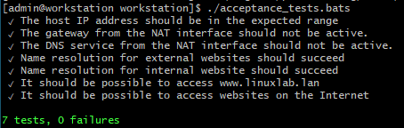

# Enterprise Linux Laboverslag - Troubleshooting

- Student: Yves Masscho
- Klasgroep: TIAOATN/S1 (Afstandsleren)

## Verslag

### Fase 1: Link Layer

1. We kijken of kabels aangesloten zijn. Overal staat UP dus dit is in orde. Ook in VirtualBox lijkt alles op het eerste zicht OK.

- server
```
[vagrant@server ~]$ ip link
1: lo: <LOOPBACK,UP,LOWER_UP> mtu 65536 qdisc noqueue state UNKNOWN mode DEFAULT group default qlen 1000
    link/loopback 00:00:00:00:00:00 brd 00:00:00:00:00:00
2: eth0: <BROADCAST,MULTICAST,UP,LOWER_UP> mtu 1500 qdisc fq_codel state UP mode DEFAULT group default qlen 1000
    link/ether 08:00:27:bb:4f:a7 brd ff:ff:ff:ff:ff:ff
3: eth1: <BROADCAST,MULTICAST,UP,LOWER_UP> mtu 1500 qdisc fq_codel state UP mode DEFAULT group default qlen 1000
    link/ether 08:00:27:e3:85:31 brd ff:ff:ff:ff:ff:ff
```
- workstation
```
[vagrant@workstation ~]$ ip link
1: lo: <LOOPBACK,UP,LOWER_UP> mtu 65536 qdisc noqueue state UNKNOWN mode DEFAULT group default qlen 1000
    link/loopback 00:00:00:00:00:00 brd 00:00:00:00:00:00
2: eth0: <BROADCAST,MULTICAST,UP,LOWER_UP> mtu 1500 qdisc fq_codel state UP mode DEFAULT group default qlen 1000
    link/ether 08:00:27:bb:4f:a7 brd ff:ff:ff:ff:ff:ff
3: eth1: <BROADCAST,MULTICAST,UP,LOWER_UP> mtu 1500 qdisc fq_codel state UP mode DEFAULT group default qlen 1000
    link/ether 08:00:27:82:f0:d8 brd ff:ff:ff:ff:ff:ff
```
- router
```
vagrant@Router:~$ ip link
1: lo: <LOOPBACK,UP,LOWER_UP> mtu 65536 qdisc noqueue state UNKNOWN mode DEFAULT group default
    link/loopback 00:00:00:00:00:00 brd 00:00:00:00:00:00
2: eth0: <BROADCAST,MULTICAST,UP,LOWER_UP> mtu 1500 qdisc pfifo_fast state UP mode DEFAULT group default qlen 1000
    link/ether 08:00:27:28:d5:52 brd ff:ff:ff:ff:ff:ff
    alias WAN
3: eth1: <BROADCAST,MULTICAST,UP,LOWER_UP> mtu 1500 qdisc pfifo_fast state UP mode DEFAULT group default qlen 1000
    link/ether 08:00:27:ce:bc:d1 brd ff:ff:ff:ff:ff:ff
    alias LAN
```

### Fase 2: Network Layer

2. We runnen `ip a` en zien dat de workstation geen ip adres heeft op eth1.
```
3: eth1: <BROADCAST,MULTICAST,UP,LOWER_UP> mtu 1500 qdisc fq_codel state UP group default qlen 1000
    link/ether 08:00:27:82:f0:d8 brd ff:ff:ff:ff:ff:ff
```
- Bij de router zien we dat eth1 twee ip adressen heeft, een met /16 en een met /24. In alle andere toestellen heeft de 192.168 ook een /16. Volgens de regels van private addressing moet dit allemaal /24 zijn. De prefix van de omgeving is dan 192.168.20.0/24.

```
3: eth1: <BROADCAST,MULTICAST,UP,LOWER_UP> mtu 1500 qdisc pfifo_fast state UP group default qlen 1000
    link/ether 08:00:27:ce:bc:d1 brd ff:ff:ff:ff:ff:ff
    inet 192.168.20.101/16 brd 192.168.255.255 scope global eth1
       valid_lft forever preferred_lft forever
    inet 192.168.20.101/24 brd 192.168.20.255 scope global eth1
       valid_lft forever preferred_lft forever
```
3. We passen dit aan in vagrant-hosts. Geen provision maar destroy-up deze keer. Resultaat:

- server:
```
3: eth1: <BROADCAST,MULTICAST,UP,LOWER_UP> mtu 1500 qdisc fq_codel state UP group default qlen 1000
    link/ether 08:00:27:7f:4d:6e brd ff:ff:ff:ff:ff:ff
    inet 192.168.20.2/24 brd 192.168.20.255 scope global noprefixroute eth1
       valid_lft forever preferred_lft forever
    inet6 fe80::a00:27ff:fe7f:4d6e/64 scope link
       valid_lft forever preferred_lft forever
```

- router:

```
3: eth1: <BROADCAST,MULTICAST,UP,LOWER_UP> mtu 1500 qdisc pfifo_fast state UP group default qlen 1000
    link/ether 08:00:27:fd:ab:d7 brd ff:ff:ff:ff:ff:ff
    inet 192.168.20.101/24 brd 192.168.20.255 scope global eth1
       valid_lft forever preferred_lft forever
```

4. Het IP Addres op de router is ook verkeerd. De opdracht zegt weliswaar om te fixen en niet te automatiseren dus ik verander via vyos commands.

```
vagrant@Router# set interfaces ethernet eth1 address '192.168.20.254/24'
[edit]
vagrant@Router# del interfaces ethernet eth1 address '192.168.20.101/24'
[edit]
vagrant@Router# commit
[edit]
vagrant@Router# save
Saving configuration to '/config/config.boot'...
Done
[edit]
vagrant@Router# show interfaces
 ethernet eth0 {
     address dhcp
     description WAN
     duplex auto
     hw-id 08:00:27:28:d5:52
     smp_affinity auto
     speed auto
 }
 ethernet eth1 {
     address 192.168.20.254/24
     description LAN
     hw-id 08:00:27:fd:ab:d7
 }
 loopback lo {
 }
```


### Fase 3: Transport Layer

5. Firewall ziet er niet goed uit op de server, geen dhcp (voor ipv4)
```
[vagrant@server ~]$ sudo firewall-cmd --list-all
public (active)
  target: default
  icmp-block-inversion: no
  interfaces: eth0 eth1
  sources:
  services: cockpit dhcpv6-client dns http ssh
  ports: 67/tcp
  protocols:
  masquerade: no
  forward-ports:
  source-ports:
  icmp-blocks:
  rich rules:
```
- added
```
[vagrant@server ~]$ sudo firewall-cmd --add-service dhcp --permanent
success
[vagrant@server ~]$ sudo firewall-cmd --reload
success
```
- check: ok
```
[vagrant@server ~]$ sudo firewall-cmd --list-all
public (active)
  target: default
  icmp-block-inversion: no
  interfaces: eth0 eth1
  sources:
  services: cockpit dhcp dhcpv6-client dns http ssh
  ports: 67/tcp
  protocols:
  masquerade: no
  forward-ports:
  source-ports:
  icmp-blocks:
  rich rules:
```

6. Configuratie van eth1 op workstation ziet er goed uit.

```
[vagrant@workstation network-scripts]$ sudo cat ifcfg-eth1
#VAGRANT-BEGIN
# The contents below are automatically generated by Vagrant. Do not modify.
BOOTPROTO=dhcp
ONBOOT=yes
DEVICE=eth1
NM_CONTROLLED=yes
#VAGRANT-END
```

7. dhcp is down -> Enabled

```
[vagrant@server ~]$ sudo systemctl status dhcpd
● dhcpd.service - DHCPv4 Server Daemon
   Loaded: loaded (/usr/lib/systemd/system/dhcpd.service; enabled; vendor preset: disabled)
   Active: inactive (dead)
     Docs: man:dhcpd(8)
           man:dhcpd.conf(5)

[vagrant@server ~]$ sudo systemctl enable --now dhcpd
```
- check: ok
```
[vagrant@server ~]$ sudo systemctl status dhcpd
● dhcpd.service - DHCPv4 Server Daemon
   Loaded: loaded (/usr/lib/systemd/system/dhcpd.service; enabled; vendor preset: disabled)
   Active: active (running) since Sun 2021-12-12 14:05:25 UTC; 35s ago
```

8. dnsmasq not running, fixed

```
[vagrant@server ~]$ sudo systemctl status dnsmasq
● dnsmasq.service - DNS caching server.
   Loaded: loaded (/usr/lib/systemd/system/dnsmasq.service; enabled; vendor preset: disabled)
   Active: inactive (dead)

[vagrant@server ~]$ sudo systemctl enable dnsmasq --now

[vagrant@server ~]$ sudo systemctl status dnsmasq
● dnsmasq.service - DNS caching server.
   Loaded: loaded (/usr/lib/systemd/system/dnsmasq.service; enabled; vendor preset: disabled)
   Active: active (running) since Sun 2021-12-12 14:17:37 UTC; 2s ago
 Main PID: 5902 (dnsmasq)
    Tasks: 1 (limit: 4949)
   Memory: 792.0K
   CGroup: /system.slice/dnsmasq.service
           └─5902 /usr/sbin/dnsmasq -k

Dec 12 14:17:37 server systemd[1]: Started DNS caching server..
Dec 12 14:17:37 server dnsmasq[5902]: started, version 2.79 cachesize 150
Dec 12 14:17:37 server dnsmasq[5902]: compile time options: IPv6 GNU-getopt DBus no-i18n IDN2 DHCP DHCPv6 no-Lua TFTP no-conntrack ip>
Dec 12 14:17:37 server dnsmasq[5902]: reading /etc/resolv.conf
Dec 12 14:17:37 server dnsmasq[5902]: using nameserver 10.0.2.3#53
Dec 12 14:17:37 server dnsmasq[5902]: read /etc/hosts - 4 addresses
```

9. Niets aan te merken op de ports.

```
[vagrant@server etc]$ sudo ss -tulpn
Netid         State           Recv-Q          Send-Q                   Local Address:Port                   Peer Address:Port         Process
udp           UNCONN          0               0                              0.0.0.0:53                          0.0.0.0:*             users:(("dnsmasq",pid=5995,fd=4))
udp           UNCONN          0               0                              0.0.0.0:67                          0.0.0.0:*             users:(("dhcpd",pid=5832,fd=10))
udp           UNCONN          0               0                              0.0.0.0:111                         0.0.0.0:*             users:(("rpcbind",pid=614,fd=5),("systemd",pid=1,fd=37))
udp           UNCONN          0               0                            127.0.0.1:323                         0.0.0.0:*             users:(("chronyd",pid=691,fd=6))
udp           UNCONN          0               0                                 [::]:53                             [::]:*             users:(("dnsmasq",pid=5995,fd=6))
udp           UNCONN          0               0                                 [::]:111                            [::]:*             users:(("rpcbind",pid=614,fd=7),("systemd",pid=1,fd=40))
udp           UNCONN          0               0                                [::1]:323                            [::]:*             users:(("chronyd",pid=691,fd=7))
tcp           LISTEN          0               128                            0.0.0.0:111                         0.0.0.0:*             users:(("rpcbind",pid=614,fd=4),("systemd",pid=1,fd=36))
tcp           LISTEN          0               32                             0.0.0.0:53                          0.0.0.0:*             users:(("dnsmasq",pid=5995,fd=5))
tcp           LISTEN          0               128                            0.0.0.0:22                          0.0.0.0:*             users:(("sshd",pid=718,fd=4))
tcp           LISTEN          0               128                               [::]:111                            [::]:*             users:(("rpcbind",pid=614,fd=6),("systemd",pid=1,fd=38))
tcp           LISTEN          0               128                                  *:80                                *:*             users:(("httpd",pid=5429,fd=4),("httpd",pid=5428,fd=4),("httpd",pid=5427,fd=4),("httpd",pid=5424,fd=4))
tcp           LISTEN          0               32                                [::]:53                             [::]:*             users:(("dnsmasq",pid=5995,fd=7))
tcp           LISTEN          0               128                               [::]:22                             [::]:*             users:(("sshd",pid=718,fd=6))
```

10. De webserver runt

```
[vagrant@server ~]$ sudo systemctl status httpd
● httpd.service - The Apache HTTP Server
   Loaded: loaded (/usr/lib/systemd/system/httpd.service; enabled; vendor preset:
```


### Fase 4: APP Layer

11. De file voor dhcp zit vol fouten.
```
# dhcpd.conf -- linuxlab.lan

authoritative;

subnet 192.168.200.0 netmask 255.255.128.0 {
  range 192.168.20.101 172.20.0.253;

  option domain-name "linuxlab.lan";
  option routers 192.168.20.254;
  option domain-name-servers 192.168.20.2;

  default-lease-time 14400;
  max-lease-time 21600;
}

```
- Dit wordt :
```
# dhcpd.conf -- linuxlab.lan

authoritative;

subnet 192.168.20.0 netmask 255.255.255.0 {
  range 192.168.20.101 192.168.20.253;

  option domain-name "linuxlab.lan";
  option routers 192.168.20.254;
  option domain-name-servers 192.168.20.2;

  default-lease-time 14400;
  max-lease-time 21600;
}
```

12. Koppelen dit aan, dhcp geeft een adres uit de range.
```
[vagrant@workstation workstation]$ ip a

3: eth1: <BROADCAST,MULTICAST,UP,LOWER_UP> mtu 1500 qdisc fq_codel state UP group default qlen 1000
    link/ether 08:00:27:3a:28:19 brd ff:ff:ff:ff:ff:ff
    inet 192.168.20.102/24 brd 192.168.20.255 scope global dynamic noprefixroute eth1
       valid_lft 14281sec preferred_lft 14281sec
    inet6 fe80::5381:3050:428a:d697/64 scope link noprefixroute
       valid_lft forever preferred_lft forever
```
13. We kunnen nu via ssh in de workstation en NAT mag uit.
```
[vagrant@server ~]$ ssh admin@192.168.20.102
The authenticity of host '192.168.20.102 (192.168.20.102)' can't be established.
ECDSA key fingerprint is SHA256:IpH8qcy1/FtH+E0lbHw5v8/KYmHgcyq4A6+JT/MP1tE.
Are you sure you want to continue connecting (yes/no/[fingerprint])? yes
Warning: Permanently added '192.168.20.102' (ECDSA) to the list of known hosts.
admin@192.168.20.102's password:

This system is built by the Bento project by Chef Software
More information can be found at https://github.com/chef/bento
[admin@workstation ~]$
```

14. Er is contact met het interne netwerk en de buitenwereld.

```
[admin@workstation workstation]$ curl icanhazip.org
78.22.239.182

[admin@workstation workstation]$ curl www.linuxlab.lan
welcome to linuxlab.lan
```

## Eindresultaat



## Referenties

- Alle Bertvv docu
- https://wiki.archlinux.org/title/dnsmasq#Manual_forwarding (uiteindelijk nutteloos)
