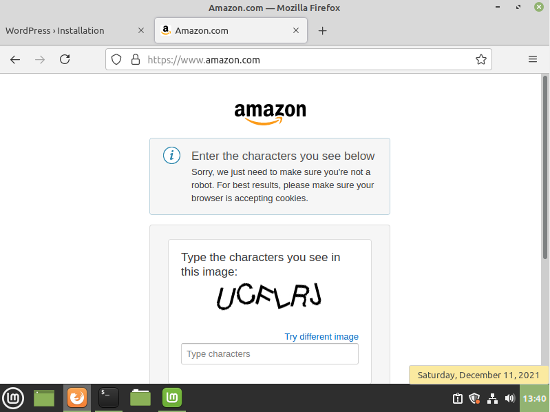

# Lab Report: Config Management

## Basic Setup

1. We do a `vagrant up` in the vmlab folder and as argument we add `srv010`, meaning we only make that one vm go live.

```
Yves@DESKTOP-TV19DVA MINGW64 ~/Automate/infra-2122-Yves-Masscho/vmlab (solution)
$ vagrant up srv010
Bringing machine 'srv010' up with 'virtualbox' provider...
==> srv010: Box 'bento/almalinux-8' could not be found. Attempting to find and install...
    srv010: Box Provider: virtualbox
    srv010: Box Version: >= 0
==> srv010: Loading metadata for box 'bento/almalinux-8'
    srv010: URL: https://vagrantcloud.com/bento/almalinux-8
==> srv010: Adding box 'bento/almalinux-8' (v202109.10.0) for provider: virtualbox
    srv010: Downloading: https://vagrantcloud.com/bento/boxes/almalinux-8/versions/202109.10.0/providers/virtualbox.box
    srv010:
==> srv010: Successfully added box 'bento/almalinux-8' (v202109.10.0) for 'virtualbox'!
==> srv010: Importing base box 'bento/almalinux-8'...
==> srv010: Matching MAC address for NAT networking...
==> srv010: Checking if box 'bento/almalinux-8' version '202109.10.0' is up to date...
==> srv010: Setting the name of the VM: vmlab_srv010_1637604465243_23490
==> srv010: Fixed port collision for 22 => 2222. Now on port 2200.
==> srv010: Clearing any previously set network interfaces...
==> srv010: Preparing network interfaces based on configuration...
    srv010: Adapter 1: nat
    srv010: Adapter 2: hostonly
==> srv010: Forwarding ports...
    srv010: 22 (guest) => 2200 (host) (adapter 1)
==> srv010: Running 'pre-boot' VM customizations...
==> srv010: Booting VM...
==> srv010: Waiting for machine to boot. This may take a few minutes...
    srv010: SSH address: 127.0.0.1:2200
    srv010: SSH username: vagrant
    srv010: SSH auth method: private key
    srv010:
    srv010: Vagrant insecure key detected. Vagrant will automatically replace
    srv010: this with a newly generated keypair for better security.
    srv010:
    srv010: Inserting generated public key within guest...
    srv010: Removing insecure key from the guest if it's present...
    srv010: Key inserted! Disconnecting and reconnecting using new SSH key...
==> srv010: Machine booted and ready!
==> srv010: Checking for guest additions in VM...
==> srv010: Setting hostname...
==> srv010: Configuring and enabling network interfaces...
==> srv010: Mounting shared folders...
    srv010: /vagrant => C:/Users/Yves/Automate/infra-2122-Yves-Masscho/vmlab
==> srv010: Running provisioner: ansible_local...
    srv010: Installing Ansible...
    srv010: Running ansible-playbook...

PLAY [all] *********************************************************************

TASK [Gathering Facts] *********************************************************
[WARNING]: Platform linux on host srv010 is using the discovered Python
interpreter at /usr/bin/python3.6, but future installation of another Python
interpreter could change this. See https://docs.ansible.com/ansible/2.9/referen
ce_appendices/interpreter_discovery.html for more information.
ok: [srv010]

PLAY RECAP *********************************************************************
srv010                     : ok=1    changed=0    unreachable=0    failed=0    skipped=0    rescued=0    ignored=0
```

2. We add the role bertvv.rh-base to the site.yml under all hosts, and provision.

```
# site.yml
---
- hosts: all
  roles:
    - bertvv.rh-base
```

```
Yves@DESKTOP-TV19DVA MINGW64 ~/Automate/infra-2122-Yves-Masscho/vmlab (solution)
$ vagrant provision
==> srv010: Running provisioner: ansible_local...
    srv010: Running ansible-playbook...
ERROR! the role 'bertvv.rh-base' was not found in /vagrant/ansible/roles:/home/vagrant/.ansible/roles:/usr/share/ansible/roles:/etc/ansible/roles:/vagrant/ansible

The error appears to be in '/vagrant/ansible/site.yml': line 5, column 7, but may
be elsewhere in the file depending on the exact syntax problem.

The offending line appears to be:

  roles:
    - bertvv.rh-base
      ^ here
Ansible failed to complete successfully. Any error output should be
visible above. Please fix these errors and try again.
```

3. This failed so we use the `role-deps.sh` script to download the role into the roles folder.

```
[vagrant@srv010 vagrant]$ ./scripts/role-deps.sh
- downloading role 'rh-base', owned by bertvv
- downloading role from https://github.com/bertvv/ansible-role-rh-base/archive/v4.0.3.tar.gz
- extracting bertvv.rh-base to /vagrant/ansible/roles/bertvv.rh-base
- bertvv.rh-base (v4.0.3) was installed successfully
```

4. We provision again and this works with 0 fails. Output ommited because of length.

```
$ vagrant provision
==> srv010: Running provisioner: ansible_local...
    srv010: Running ansible-playbook...

***OMMITTED***

PLAY RECAP *********************************************************************
srv010                     : ok=34   changed=15   unreachable=0    failed=0    skipped=18   rescued=0    ignored=0
```


5. Added below parameters to all.yml

```
# group_vars/all.yml
# Variables visible to all nodes
---

rhbase_repositories:
  - epel-release
rhbase_install_packages:
  - bash-completion
  - vim-enhanced
```

6. Running another provision

```
PLAY RECAP *********************************************************************
srv010                     : ok=32   changed=1    unreachable=0    failed=0    skipped=18   rescued=0    ignored=0
```

7. We expand the number of packages that need to be installed, adding to `rhbase_install_packages` in `all.yml`.

```
rhbase_install_packages:
  - bash-completion
  - vim-enhanced
  - bind-utils
  - git
  - nano
  - tree
  - wget
```

8. Another provision gives us these specifics in the wall of lines output, meaning it worked:

```
TASK [bertvv.rh-base : Install | Ensure specified packages are installed] ******
changed: [srv010]
```

9. Adding our public ssh-key to `all.yml` allows us to ssh into the server:
```
$ ssh yves@172.16.128.10
The authenticity of host '172.16.128.10 (172.16.128.10)' can't be established.
ED25519 key fingerprint is SHA256:OfN1dlQqG1ceLJSwasMIGt/mwWZHWCgbZ0UhgyBDU3c.
This key is not known by any other names
Are you sure you want to continue connecting (yes/no/[fingerprint])? yes
Warning: Permanently added '172.16.128.10' (ED25519) to the list of known hosts.
Enter passphrase for key '/c/Users/Yves/.ssh/id_rsa':

This system is built by the Bento project by Chef Software
More information can be found at https://github.com/chef/bento
```
## Implementing a web server on SRV010

10. We add the mariadb role to our `site.yml` and run the `role-deps.sh` script again.

```
[yves@srv010 ~]$ cd /
[yves@srv010 /]$ ls
bin  boot  dev  etc  home  lib  lib64  media  mnt  opt  proc  root  run  sbin  srv  sys  tmp  usr  vagrant  var
[yves@srv010 /]$ cd vagrant
[yves@srv010 vagrant]$ ./scripts/role-deps.sh
- downloading role 'mariadb', owned by bertvv
- downloading role from https://github.com/bertvv/ansible-role-mariadb/archive/v3.1.2.tar.gz
- extracting bertvv.mariadb to /vagrant/ansible/roles/bertvv.mariadb
- bertvv.mariadb (v3.1.2) was installed successfully
+ Skipping bertvv.rh-base, seems to be installed already
```

11. Run a first provision without adding databases or users
```
PLAY RECAP *********************************************************************
srv010                     : ok=56   changed=13   unreachable=0    failed=0    skipped=22   rescued=0    ignored=0
```

12. I added a folder `host_vars` and a file `srv010.yml` with the following initial content:

```
# ansible/host_vars/srv010.yml

#MARIADB
mariadb_databases:
  - name: wordpress
mariadb_root_password: wordroot123
mariadb_users:
  - name: wordpress
    password: wordpress123
    priv: 'wordpress.*:ALL'
```

And run another provision:

```
PLAY RECAP *********************************************************************
srv010                     : ok=58   changed=2    unreachable=0    failed=0    skipped=20   rescued=0    ignored=0
```

13. Checking the machine with `sudo mysql -uroot` and `show databases;` + `select user,host,password from mysql.user;` gives us the following expected outcome:

```
[vagrant@srv010 ~]$ sudo mysql -uroot
Welcome to the MariaDB monitor.  Commands end with ; or \g.
Your MariaDB connection id is 12
Server version: 10.6.5-MariaDB MariaDB Server

Copyright (c) 2000, 2018, Oracle, MariaDB Corporation Ab and others.

Type 'help;' or '\h' for help. Type '\c' to clear the current input statement.

MariaDB [(none)]> show databases;
+--------------------+
| Database           |
+--------------------+
| information_schema |
| mysql              |
| performance_schema |
| sys                |
| wordpress          |
+--------------------+
5 rows in set (0.001 sec)

MariaDB [(none)]> select user,host,password from mysql.user;
+-------------+-----------+-------------------------------------------+
| User        | Host      | Password                                  |
+-------------+-----------+-------------------------------------------+
| mariadb.sys | localhost |                                           |
| root        | localhost | invalid                                   |
| mysql       | localhost | invalid                                   |
| wordpress   | localhost | *E2C156CF746C7E6EEA9D9FBECE7422C82E7E649B |
+-------------+-----------+-------------------------------------------+
4 rows in set (0.001 sec)
```

14. The user is also able to log into the database.
```
[vagrant@srv010 ~]$ mysql -uwordpress -pwordpress123 wordpress
Welcome to the MariaDB monitor.  Commands end with ; or \g.
Your MariaDB connection id is 3
Server version: 10.6.5-MariaDB MariaDB Server

Copyright (c) 2000, 2018, Oracle, MariaDB Corporation Ab and others.

Type 'help;' or '\h' for help. Type '\c' to clear the current input statement.
```


## Adding Apache to SRV010

15. We add the role `bertvv.httpd` to the `srv010.yml` file, run `role-deps.sh` and provision.
```
PLAY RECAP *********************************************************************
srv010                     : ok=67   changed=6    unreachable=0    failed=0    skipped=25   rescued=0    ignored=0
```

16. We add some relevant services to the firewall-allow list by adding the following to `srv010.yml`

```
rhbase_firewall_allow_services:
  - http
  - https
  - ssh
```

17. Surfing to the webpage shows us that apache is running and also reachable from outside the VM (Firewall allows it).


## Adding wordpress to SRV010

18. We install the role `bertvv.wordpress` and run the `role-deps.sh` script. We also change some things in the `bertvv.wordpress/tasks/install.yml` according to the Teams channel as a fix to an install problem. Line 49 is changed:

```
- name: Setting SELinux context
  sefcontext:
    target: "{{ wordpress_directory }}"
    setype: httpd_sys_rw_content_t
    state: present
```

19. We provision and check the website `http://172.16.128.10/wordpress/` to see this works too now. All that remains now is to add a certificate.


20. Added certificates:

```
[vagrant@srv010 files]$ openssl genrsa -out ca.key 2048
Generating RSA private key, 2048 bit long modulus (2 primes)
...........+++++
...........+++++
e is 65537 (0x010001)
[vagrant@srv010 files]$ openssl req -new -key ca.key -out ca.csr
You are about to be asked to enter information that will be incorporated
into your certificate request.
What you are about to enter is what is called a Distinguished Name or a DN.
There are quite a few fields but you can leave some blank
For some fields there will be a default value,
If you enter '.', the field will be left blank.
-----
Country Name (2 letter code) [XX]:BE
State or Province Name (full name) []:OVL
Locality Name (eg, city) [Default City]:GENT
Organization Name (eg, company) [Default Company Ltd]:infralab
Organizational Unit Name (eg, section) []:
Common Name (eg, your name or your server's hostname) []:infra.lan
Email Address []:yves.masscho@student.hogent.be

Please enter the following 'extra' attributes
to be sent with your certificate request
A challenge password []:2323
An optional company name []:infra
[vagrant@srv010 files]$ openssl x509 -req -days 365 -in ca.csr -signkey ca.key -out ca.crt
Signature ok
subject=C = BE, ST = OVL, L = GENT, O = infralab, CN = infra.lan, emailAddress = yves.masscho@student.hogent.be
Getting Private key
[vagrant@srv010 files]$ ls
ca.crt  ca.csr  ca.key
```


## DNS Server on SRV001

21. To add a new server and a role we add the following:

- To the folder host_vars we add a file srv001.yml, empty for now.
- To `site.yml` we add the following:
```
- hosts: srv001
  roles:
    - bertvv.bind
```

- To `vagrant-hosts.yml` we add the following:
```
- name: srv001
  ip: 172.16.128.2
  netmask: 255.255.0.0
  box: bento/almalinux-8
```

22. To make dhcp work outside of our server we need to add it to the firewall settings

```
rhbase_firewall_allow_services:
  - dns
```

23. I will put a link here to [srv001.yml](/vmlab/ansible/host_vars/srv001.yml) because copying the whole thing is redundant. I have put comments at each section saying what it does.

24. Querying from the host system works.

```
C:\Users\Yves>nslookup www.infra.lan 172.16.128.2
Server:  srv001.infra.lan
Address:  172.16.128.2

Name:    srv010.infra.lan
Address:  172.16.128.10
Aliases:  www.infra.lan


C:\Users\Yves>nslookup 172.16.128.3 172.16.128.2
Server:  srv001.infra.lan
Address:  172.16.128.2

Name:    srv003.infra.lan
Address:  172.16.128.3
```

- edit: We removed `bind_forward_only: true` and added `bind_recursion: true`. Now dns-requests for external work too.
```
C:\Users\Yves>nslookup google.com 172.16.128.2
Server:  srv001.infra.lan
Address:  172.16.128.2

Non-authoritative answer:
Name:    google.com
Addresses:  2a00:1450:400e:803::200e
          142.251.39.110

C:\Users\Yves>nslookup 8.8.8.8 172.16.128.2
Server:  srv001.infra.lan
Address:  172.16.128.2

Name:    dns.google
Address:  8.8.8.8

```

- Added @ to host file to make the website infra.lan reachable without a subdomain.
```
C:\Users\Yves>nslookup infra.lan 172.16.128.2
Server:  srv001.infra.lan
Address:  172.16.128.2

Name:    infra.lan
```


## DHCP Server on SRV003

25. To add a new server and a role we add the following:

- To the folder host_vars we add a file srv003.yml, empty for now.
- To `site.yml` we add the following:
```
- hosts: srv003
  roles:
    - bertvv.dhcp
```

- To `vagrant-hosts.yml` we add the following:
```
- name: srv003
  ip: 172.16.128.3
  netmask: 255.255.0.0
  box: bento/almalinux-8
```

26. To make dhcp work outside of our server we need to add it to the firewall settings

```
rhbase_firewall_allow_services:
  - dhcp
```

## ROUTER

27. We installeren de router met de bijhorende image in de juiste plaats.

28. We stellen de netwerkadapters correct in.


29. We configureren even wat dingen manueel zodat we een IP adres hebben voor SSH.


30. Na het maken van de inventory file testen we het volgende:

``` 
[vagrant@srv001 ansible]$ ansible -i inventory.yml -m ios_facts -a "gather_subset=all" all
CSR1kv | FAILED! => {
    "msg": "the connection plugin 'ansible.netcommon.network_cli' was not found"
}
```

31. We passen de ansible_connection aan naar onderstaande:

```
# Inventory file for accessing a Cisco CSR1000v VirtualBox VM
---
all:
  hosts:
    CSR1kv:
      ansible_connection: "network_cli"  #ansible.netcommon.
      ansible_network_os: "ios"
      ansible_host: "172.16.255.254"
      ansible_port: 5022
      ansible_user: "cisco"
      ansible_password: "cisco123!"
```

32. Opnieuw testen:

```
[vagrant@srv001 ansible]$ ansible -i inventory.yml -m ios_facts -a "gather_subset=all" all
[WARNING]: Platform linux on host CSR1kv is using the discovered Python interpreter at /usr/bin/python3.6, but future installation of another Python interpreter could change this. See https://docs.ansible.com/ansible/2.9/reference_appendices/interpreter_discovery.html
for more information.
CSR1kv | FAILED! => {
    "ansible_facts": {
        "discovered_interpreter_python": "/usr/bin/python3.6"
    },
    "changed": false,
    "msg": "[Errno None] Unable to connect to port 5022 on 172.16.255.254"
}
```

33. We testen of ssh-en lukt van de VM. Dit lukt:

```
[vagrant@srv001 ansible]$ ssh cisco@172.16.255.254
The authenticity of host '172.16.255.254 (172.16.255.254)' can't be established.
RSA key fingerprint is SHA256:oO5oUAOS3eRC/VHOOUCeHGjY3GpigypbUJ7BlwRqx/I.
Are you sure you want to continue connecting (yes/no/[fingerprint])? yes
Warning: Permanently added '172.16.255.254' (RSA) to the list of known hosts.
Password:

*                                           *
**                                         **
***                                       ***
***  Cisco Networking Academy             ***
***   Emerging Technologies Workshop:     ***
***    Model Driven Programmability       ***
***                                       ***
***  This software is provided for        ***
***   Educational Purposes                ***
***    Only in Networking Academies       ***
***                                       ***
**                                         **
*                                           *
```

34. We passen de port aan in de inventory naar 22. Testen opnieuw. Dit lukt.

```
[vagrant@srv001 ansible]$ ansible -i inventory.yml -m ios_facts -a "gather_subset=all" all
[WARNING]: default value for `gather_subset` will be changed to `min` from `!config` v2.11 onwards
[WARNING]: Platform linux on host CSR1kv is using the discovered Python interpreter at /usr/bin/python3.6, but future installation of another Python interpreter could change this. See https://docs.ansible.com/ansible/2.9/reference_appendices/interpreter_discovery.html
for more information.
CSR1kv | SUCCESS => {
    "ansible_facts": {
        "ansible_net_all_ipv4_addresses": [
            "10.0.2.15",
            "172.16.255.254"
        ],
        "ansible_net_all_ipv6_addresses": [],

ETC
```

35. Hieronder moet tweemaal cisco.ios. weggehaald worden.
```
# Router configuration playbook
---
- hosts: CSR1kv
  tasks:
    - name: Set interface GE2
      cisco.ios.ios_l3_interfaces:
        config:
          - name: GigabitEthernet2
            ipv4:
              - address: 172.16.255.254/16
        state: merged
    - name: Enable GE2
      cisco.ios.ios_interfaces:
        config:
          - name: GigabitEthernet2
            enabled: yes
        state: merged
```


36. Het runnen van de playbook lukt perfect.

```
[vagrant@srv001 ansible]$ ansible-playbook -i inventory.yml router-config.yml

PLAY [CSR1kv] *****************************************************************************************************************************************************************************************************************************************************************

TASK [Gathering Facts] ********************************************************************************************************************************************************************************************************************************************************
[WARNING]: Ignoring timeout(10) for ios_facts
[WARNING]: default value for `gather_subset` will be changed to `min` from `!config` v2.11 onwards
[WARNING]: Platform linux on host CSR1kv is using the discovered Python interpreter at /usr/bin/python3.6, but future installation of another Python interpreter could change this. See https://docs.ansible.com/ansible/2.9/reference_appendices/interpreter_discovery.html
for more information.
ok: [CSR1kv]

TASK [Set interface GE2] ******************************************************************************************************************************************************************************************************************************************************
ok: [CSR1kv]

TASK [Enable GE2] *************************************************************************************************************************************************************************************************************************************************************
ok: [CSR1kv]

PLAY RECAP ********************************************************************************************************************************************************************************************************************************************************************
CSR1kv                     : ok=3    changed=0    unreachable=0    failed=0    skipped=0    rescued=0    ignored=0
```

37. Een fout ontdekt.
- In srv003.yml stond de nameserver verkeerd, aangepast naar 128.2

38. We booten een VM (Linux Mint - Ubuntu) op het host only netwerk.
We voegden ook het volgende toe aan srv003.yml

```
dhcp_hosts:
  - name: workstation1
    mac: '08:00:27:06:DF:1E'
    ip: 172.16.192.2
```

39. DNS werkt op de workstation


40. Interne website is bereikbaar.


41. Externe website is bereikbaar



42. IP Add komt uit de reserved IP voor dit MAC adres.


## Resources

- https://github.com/HoGentTIN/elnx-2021-sme-Yves-Masscho
- All bertvv documentation
- https://linux.die.net/man/5/dhcpd.conf